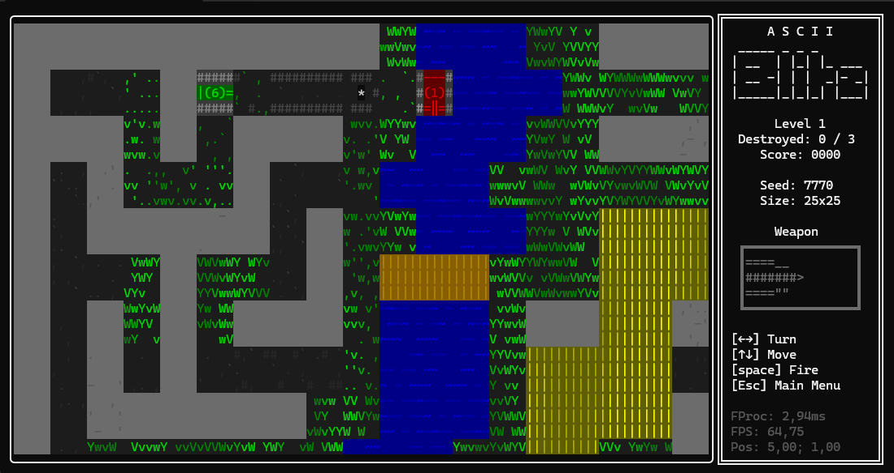

# AsciiBlitz (A Simple Tank Combat Game)

This is an educational, console-based tank combat game written in C#. The goal is to explore the
fundamentals of game architecture, including rendering, game loops, and user interaction, all
within a text-based terminal environment.



## 🎓 Purpose & Key Features

This project was created as a learning tool to explore how game engines are structured. By staying
within a simple text-based console, we can focus on the core systems without the overhead of
complex graphics.

It's not a production-grade game, but it's a solid foundation for experimenting with game
structure. Key features include:

- **Simple Tank Combat:** Classic arcade-style gameplay.
- **Procedural Maps:** Simple procedural generation for varied level layouts.
- **Screen Panning:** The camera follows the player, allowing for maps larger than the screen.
- **Console Rendering:** Optimized, diff-based rendering with 256-color support.
- **Classic Game Loop:** A fixed-timestep loop for consistent game speed.
- **Clean Architecture:** A clear separation between the reusable game engine (`Core`) and the 
    game-specific logic (`Game`).
- **Modular Design:** Uses services, state machines, and other clean patterns.
- **Simple AI:** Basic AI behaviors for enemy tanks.

## ⚙ Requirements

- **[.NET 9.0 SDK](https://dotnet.microsoft.com/en-us/download/dotnet/9.0)**
- A compatible terminal. The game uses 256 colors and modern ANSI escape codes for its visuals,
  so a modern terminal is required.
  - **Windows**: **[Windows Terminal](https://aka.ms/terminal)** is recommended.
    The legacy Windows Console Host (the default terminal for shells like `cmd.exe` and `PowerShell`)
    is not supported due to its limited color and ANSI code support.
  - **Linux/macOS**: Any xterm-compatible terminal should work.

## ▶ How to Run

1. **Clone the repository**
2. **Build and run the project:**
   ```bash
   dotnet run --project AsciiBlitz
   ```

Alternatively, you can build the project first and then run the executable:

```bash
dotnet build
.\AsciiBlitz\bin\Debug\net9.0\AsciiBlitz.exe
```

**Important for Windows users**: Make sure to run the game within a modern terminal
  application like **Windows Terminal**. Running it in the legacy Windows Console Host
  or the built-in console of some IDEs may cause rendering issues.

## 🏗 Project Structure

The project is organized into two main folders:

- **`Core`**: This directory contains the game engine's fundamental systems, such as:
  - **Rendering**: A diff-based console renderer.
  - **Game Loop**: A classic game loop with timing control.
  - **Input**: A system for handling user input.
  - **Collision**: A simple collision detection system.
  - **State Machine**: A basic state machine for managing game states.

- **`Game`**: This directory contains the game-specific logic, including:
  - **Rooms**: Manages game screens (e.g., main menu, gameplay). Each "Room" is a self-contained
      state with its own update loop and rendering logic.
  - **Game Objects**: Player, enemies, and other entities in the game.
  - **Map**: The game world loader and generator.

## 🤝 Contributing

Contributions are welcome! Since this is an educational project, the focus is on learning
and experimenting. Feel free to open an issue to discuss bugs or new features.
